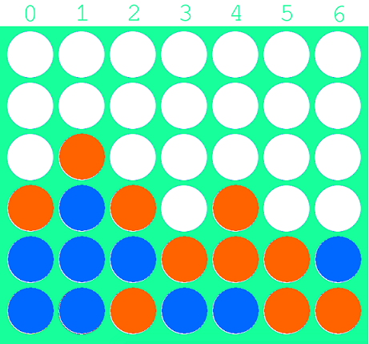

# Disconn4

### Description
A Discord bot to play Connect 4

Tech stack:
* Python
* Discord API

### How to play Connect 4
* Insert a coin on top of the board in a column that is not full
* You win if you have 4 pieces inline (row, column or diagonal)

### How to invite the bot
Invite the bot to your server by clicking [this invite link](https://discord.com/api/oauth2/authorize?client_id=835869215343771688&permissions=519232&scope=bot). You need Manage Server permission on the server.

### Commands
* Type `$help` to display the command list
* Type `$start <tag someone>` to begin a game. Keep a note of the game ID!
* Type `$move <game id> <column>` to make a move in one of your current games
* Type `$stop <game id>` to surrender a game
